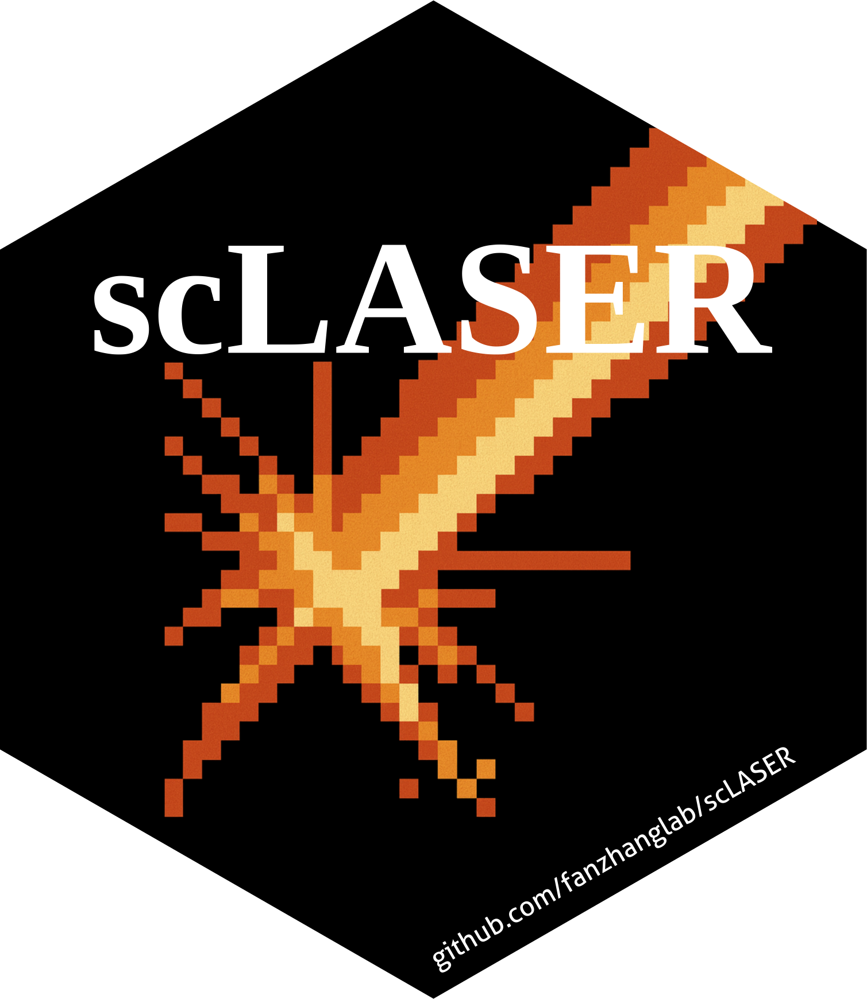

[](https://github.com/fanzhanglab/scLASER/actions/workflows/R-CMD-check.yaml)
[](https://opensource.org/licenses/MIT)


<h1 style="font-size: 38px;">scLASER</h1>



<p style="font-size: 18px; line-height: 1.6;">
Longitudinal single-cell clinical studies enable tracking within-individual cellular dynamics, but methods for modeling temporal phenotypic changes and estimating power remain limited. We present scLASER, a framework detecting time-dependent cellular neighborhood dynamics and simulating longitudinal single-cell datasets for power estimation. Across benchmarks, scLASER shows superior sensitivity, particularly for non-linear temporal patterns. Applications to inflammatory bowel disease reveal treatment-responsive NOTCH3+ stromal trajectories, while analysis of COVID-19 data identifies distinct axes of T cell activity over disease progression. scLASER enables robust longitudinal single-cell analysis and optimization of study design.

</p>

<br/>


**What does scLASER do?**  
- ***Simulate*** multiple timepoint longitudinal single-cell data, with distinct patterns between treatment responders vs non-responders  
- ***Detect*** time-dependent cell dynamics and phenotypes associated with response status  
- ***Generate*** an association score per individual cell reflecting contribution to time × clinical outcome  
- ***Validate*** cell-type classification performance for predicting time × response effects


<br/>

## Installation

To install the latest development version directly from GitHub:

```r

devtools::install_github("fanzhanglab/scLASER")

```

<br/>

### Dependencies

```r
- R (>= 4.1.0)
- methods
- stats
- utils
- Matrix
- nlme
- lme4
- pbapply
- purrr
- caret
- uwot
- Seurat
- harmony
- broom.mixed
- foreach
- doParallel
- moments
```


<br/>

## Tutorials

- [scLASER longitudinal data analytical tutorial](https://fanzhanglab.github.io/scLASER/vignettes/scLASER_longitudinal_analytical_pipeline.html)
- [scLASER longitudinal data simulation tutorial](https://fanzhanglab.github.io/scLASER/vignettes/scLASER_longitudinal_data_simulation_tutorial.html)


<br/>

## Citations

Lauren A Vanderlinden, Juan Vargas, Jun Inamo, Jade Young, Chuangqi Wang, Fan Zhang. scLASER: a robust framework for simulating and detecting time-dependent single-cell dynamics in longitudinal studies, In submission.
<br/>

## Help, Suggestion and Contribution

Using github [**issues**](https://github.com/fanzhanglab/scLaser/issues)
section, if you have any question, comments, suggestions, or to report
coding related issues of scLASER is highly encouraged than sending
emails.

- Please **check the GitHub
  [issues](https://github.com/fanzhanglab/scLASER/issues)** for similar
  issues that has been reported and resolved. This helps the team to
  focus on adding new features and working on cool projects instead of
  resolving the same issues!
- **Examples** are required when filing a GitHub issue. In certain
  cases, please share your scLASER object and related codes to understand
  the issues.
  
<br/>

## Contact 

Please contact [fanzhanglab@gmail.com](fanzhanglab@gmail.com) for further questions or potential collaborative opportunities!
