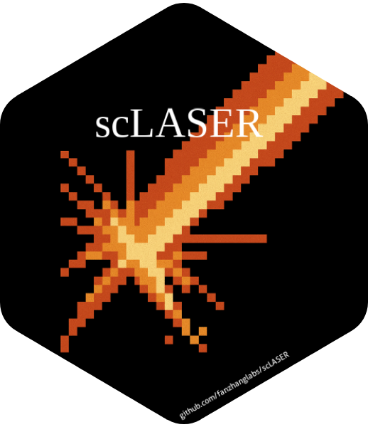

[](https://github.com/fanzhanglab/scLASER/actions/workflows/R-CMD-check.yaml)
[](https://opensource.org/licenses/MIT)


<h1 style="font-size: 38px;">scLASER</h1>



<p style="font-size: 18px; line-height: 1.6;">
Longitudinal single-cell studies enable tracking within-person dynamics over time, but lack robust methods for modeling temporal cell phenotype changes and estimating statistical power. Here we present <b>scLASER</b>, a unified framework that detects time-dependent cellular neighborhood dynamics and simulates realistic longitudinal datasets for power estimation. scLASER achieves superior sensitivity compared to frequency-based tests (97.5% vs 94.4%), with pronounced gains for rare cell types (96.7% vs 88.8%). In inflammatory bowel disease and COVID-19, scLASER revealed novel cellular dynamics: NOTCH3+ stromal neighborhoods with treatment dependent trajectories and orthogonal axes, including T cell activation, cytotoxicity, and interferon signaling, distinguishing disease progressors. scLASER enables rigorous longitudinal single-cell analysis and principled study design optimization.
</p>

<br/>

## Installation

To install the latest development version directly from GitHub:

```r

devtools::install_github("fanzhanglab/scLASER")

```

<br/>

### Dependencies / Other required packages

```r
- R (>= 4.1.0)
- methods
- stats
- utils
- Matrix
- nlme
- lme4
- dplyr
- pbapply
- purrr
- caret
- uwot
- Seurat
- harmony
- broom.mixed
- foreach
- doParallel
- moments
```


<br/>

## Tutorials

- [Simulated data and pipeline tutorial](vignettes/Simulated_data_pipeline.html)
- [General data simulation overview](vignettes/Data_simulation.html)


<br/>

## Citations

**Authors:**  
Lauren Vanderlinden (lauren.vanderlinden@cuanschutz.edu)  
Juan Vargas (juan.vargas@cuanschutz.edu)  
Fan Zhang (fanzhanglab@gmail.com)


<br/>

## Help, Suggestion and Contribution

Using github [**issues**](https://github.com/fanzhanglab/scLaser/issues)
section, if you have any question, comments, suggestions, or to report
coding related issues of scLASER is highly encouraged than sending
emails.

- Please **check the GitHub
  [issues](https://github.com/fanzhanglab/scLASER/issues)** for similar
  issues that has been reported and resolved. This helps the team to
  focus on adding new features and working on cool projects instead of
  resolving the same issues!
- **Examples** are required when filing a GitHub issue. In certain
  cases, please share your scLASER object and related codes to understand
  the issues.
  
<br/>

## Contact 

Please contact [fanzhanglab@gmail.com](fanzhanglab@gmail.com) for further questions or potential collaborative opportunities!
